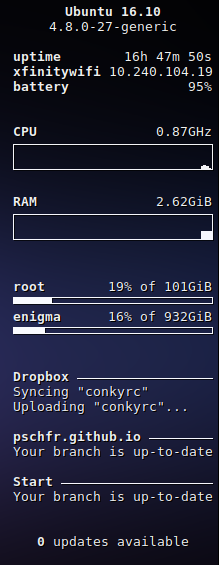

# dotfiles
A place for me to store my dotfiles, e.g. sublime settings, .gitconfigs, and other shell scripts.

## Settings
Contains tweaked settings for [VS Code](https://github.com/Microsoft/vscode), [Sublime](https://www.sublimetext.com/3), and [Hyper](https://github.com/zeit/hyper).

## Unix
`bash` contains commands I often forget and useful aliases. `zshrc` is [zsh](https://github.com/robbyrussell/oh-my-zsh)-specific settings, and `gitconfig` is obviously git-specific settings.

## Custom
### Conky
#### custom/conkyrc

### Status
#### custom/status.sh

Feel free to fork this repo to use it for yourself. Or don't.
