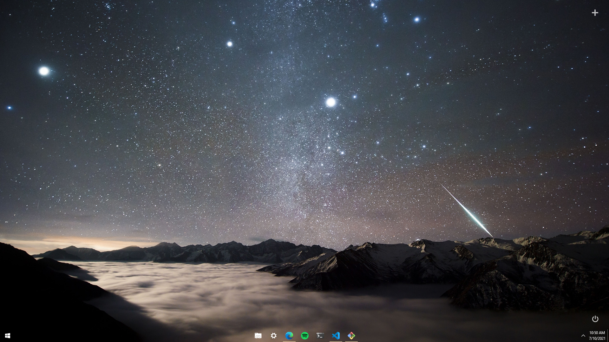

# Windows 10
recent notes on what helps with the Windows 10 experience

## Common things, of course
- Use [Ninite](https://ninite.com/) to get the common programs (Chrome, VLC, Steam, etc.)

## Theming
- ~~[TranslucentTB](https://www.microsoft.com/en-us/p/translucenttb/9pf4kz2vn4w9) ([Source](https://github.com/TranslucentTB/TranslucentTB)) - makes taskbar transparent~~ _no longer used_
- [TaskbarX](https://github.com/ChrisAnd1998/TaskbarX) - centers and makes taskbar transparent, used in combonation with [Rainmeter](https://github.com/rainmeter/rainmeter)
- [Omnimo](https://github.com/fediaFedia/Omnimo/) - Rainmeter skin, only used for power button on desktop for now
- ~~[ModernFlyouts](https://www.microsoft.com/en-us/p/modernflyouts-preview/9mt60qv066rp) ([Source](https://github.com/ModernFlyouts-Community/ModernFlyouts))~~ _not used at the moment_
- [Auto Night Mode](https://github.com/Armin2208/Windows-Auto-Night-Mode) - Changes the color scheme at sunrise and sunset
- ~~[percentage](https://github.com/kas/percentage) - battery percentage in system tray, that's it~~ _not used at the moment_
- [Flat Color W10 Icon Pack](https://www.deviantart.com/alexgal23/art/Flat-Color-W10-IconPack-558363064) - changes some of the default folder icons

## Dev-related stuffs
- [Chocolatey](https://chocolatey.org/) - a simple package manager
- [Nodist](https://github.com/nullivex/nodist) - used for managing `npm` versions
- [RubyInstaller](https://github.com/oneclick/rubyinstaller2) - pretty self-explanatory

## Microsoft Edge
- [Chrome Developer Mode Extension Warning Patcher](https://github.com/Ceiridge/Chrome-Developer-Mode-Extension-Warning-Patcher) - Disables the annoying _Disable developer extensions_ warning in Edge

## Other cool things
- [WinXCorners](https://github.com/vhanla/winxcorners) - Linux-like hotcorners
- [PowerToys](https://github.com/microsoft/PowerToys) - A collection of useful tools

## TODO:
- [ ] White icons in taskbar
- [ ] Fix the one pixel gap below the taskbar
